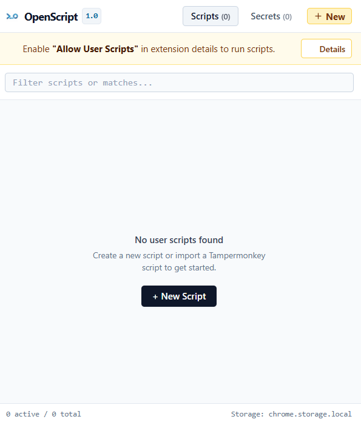

# OpenScript

A lightweight, modern script manager built for Chrome Manifest V3 with the native `chrome.userScripts` API.

**[Install from Chrome Web Store](https://chromewebstore.google.com/detail/openscript/dkelmgdchndagjemmodhkphdikhpnfol)**



## Prerequisites

OpenScript requires Chrome 138 or newer. To run scripts:

1. Install OpenScript from the [Chrome Web Store](https://chromewebstore.google.com/detail/openscript/dkelmgdchndagjemmodhkphdikhpnfol).
2. Open `chrome://extensions`.
3. Select **Details** on the OpenScript extension card.
4. Enable **Allow User Scripts**.

## Writing scripts

Scripts use a small metadata block followed by ordinary JavaScript. OpenScript supplies the async wrapper, so top-level `await`, `return`, and isolated declarations work without boilerplate.

```javascript
// ==UserScript==
// @name         GitHub Repo Stats
// @description  Logs repository metadata
// @match        https://github.com/*
// @run-at       document_idle
// ==/UserScript==

const [, owner, repo] = location.pathname.split('/');
if (!owner || !repo) return;

const response = await fetch(`https://api.github.com/repos/${owner}/${repo}`);
console.log(await response.json());
```

### Metadata

| Directive | Description | Required |
| :--- | :--- | :--- |
| `@name` | Name displayed in the popup | Yes |
| `@match` | Chrome match pattern; repeat for multiple patterns | Yes |
| `@description` | Short summary displayed in the popup | No |
| `@run-at` | `document_idle`, `document_start`, or `document_end` | No |
| `@require` | HTTP(S) library URL; repeat for multiple libraries | No |

The editor’s run-at selector is authoritative when a script is saved. Bare match URLs are normalized: `github.com/*` becomes `*://github.com/*`, and `https://github.com` becomes `https://github.com/*`.

### Secrets and environment variables

Secrets saved in the popup are synchronized through `chrome.storage.sync` and exposed to every script through either namespace:

```javascript
const token = OpenScript.env.GH_PAT;
const sameToken = env.GH_PAT;
```

### Per-script storage

Every script gets isolated, persistent storage backed by `chrome.storage.local`:

```javascript
await OpenScript.storage.set('repo_cache', { size: 1024 });
const cached = await OpenScript.storage.get('repo_cache'); // undefined when absent
const keys = await OpenScript.storage.list();
await OpenScript.storage.delete('repo_cache');
```

Stored keys are scoped to the current script and survive reloads and browser restarts. Orphaned values are removed when the popup opens after their script has been deleted.

### External libraries

Use `@require` to cache libraries when a script is saved:

```javascript
// ==UserScript==
// @name         Alerts
// @match        *://*/*
// @require      https://cdn.jsdelivr.net/npm/sweetalert2@11
// ==/UserScript==

await Swal.fire('OpenScript is ready');
```

Libraries are prepended in declaration order inside the isolated `USER_SCRIPT` world. The cached source avoids page CSP restrictions and remains available offline. If a refresh fails, OpenScript uses the last cached copy; a script with a dependency that has never been cached is not registered.

## Development

```bash
npm install
npm run dev
npm test
npm run build
npm run build:icons
npm run zip
```

## Privacy

OpenScript does not track users or send analytics. Script code and per-script state stay in `chrome.storage.local`; secrets use `chrome.storage.sync`. URLs declared with `@require` are contacted only to download their requested libraries. See the [Privacy Policy](PRIVACY.md).
